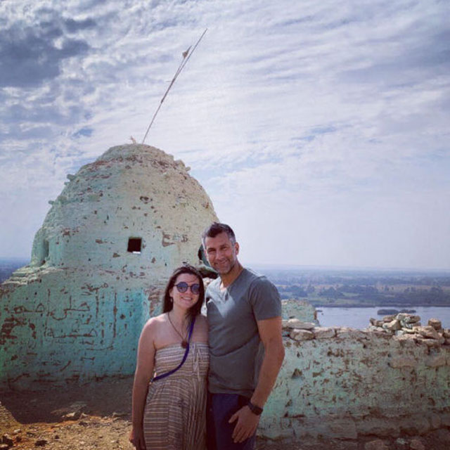

 

<!-- section 1 -->



##  Adnan Fatayerji

#### #startupminded #innovation #sustainable #allthewaygreen #dbxtoibiza #casio #music #crossfit #vegan



 

<!-- section 2 -->



|||





Honored to be part of a team that has the potential to make the world a better place by connecting billions of people to a new, accessible, data sovereign and environmentally conscious internet. A social entrepreneur, plant based warrior and a sovereign digital economy advocate with a passion for music creation and collaboration.

Adnan has been based in the United Arab Emirates for the past 20 years, during which he has built successful grass-root businesses and invested startups in various sectors. At ThreeFold Adnan is responsible for driving the ThreeFold Foundation Ecosystem. Adnan is also the CEO of the @Mazraa Cooperative which is a founding farm and P2P Cloud Capacity provider on the ThreeFold Network.





<button>[Previous](/people/kds)</button>
<button>[Next](/people/jan)</button>



